# SNB4 Security Pillar Documentation

### Contents:

1. [Istio Service Mesh](#istio-service-mesh)
2. [Secure Gateways - HTTPS](#secure-gateways--https)
3. [Snyk: GCR monitoring](#snyk-gcr-monitoring)
4. [Implementing the Vault Operator](#implementing-the-vault-operator)
5. [Armosec: E2E Kubernetes Security & Compliance](#armosec-e2e-kubernetes-security--compliance)
6. [Redis & Encryption for Data at Rest](#redis--encryption-at-rest)

## Istio Service Mesh

You can use [Istio](https://istio.io) to enable [service mesh features](https://cloud.google.com/service-mesh/docs/overview) such as traffic management, observability, and security. Istio can be provisioned using Anthos Service Mesh (ASM), the Open Source Software (OSS) istioctl tool, or via other Istio providers. You can then label individual namespaces for sidecar injection and configure an Istio gateway to replace the frontend-external load balancer.

### Provision a GKE Cluster
 
Create a GKE cluster with at least 4 nodes, machine type `e2-standard-4`, [GKE Workload Identity](https://cloud.google.com/kubernetes-engine/docs/how-to/workload-identity), and the [Kubernetes Gateway API resources](https://cloud.google.com/kubernetes-engine/docs/how-to/deploying-gateways):

_Note: using the classic `istio-ingressgateway` instead of Gateway API is another option not covered in this component._

```bash
PROJECT_ID="<your-project-id>"
ZONE="<your-GCP-zone>"
CLUSTER_NAME="onlineboutique"

gcloud container clusters create ${CLUSTER_NAME} \
    --project=${PROJECT_ID} \
    --zone=${ZONE} \
    --machine-type=e2-standard-4 \
    --num-nodes=4 \
    --workload-pool ${PROJECT_ID}.svc.id.goog \
    --gateway-api "standard"
```

### Provision and Configure Istio Service Mesh

#### Provision OSS `Istio` via istioctl

Provision the cluster with Istioctl by entering the following commands:

```bash
# Install istio 1.17 or above
istioctl install --set profile=minimal -y

# Enable sidecar injection for Kubernetes namespace(s) where microservices-demo is deployed
kubectl label namespace default istio-injection=enabled

# Make sure the istiod injection webhook port 15017 is accessible via GKE master nodes
# Otherwise your replicaset-controller may be blocked when trying to create new pods with: 
#   Error creating: Internal error occurred: failed calling 
#     webhook "namespace.sidecar-injector.istio.io" ... context deadline exceeded
gcloud compute firewall-rules list --filter="name~gke-[0-9a-z-]*-master"
NAME                          NETWORK  DIRECTION  PRIORITY  ALLOW              DENY  DISABLED
gke-onlineboutique-c94d71e8-master  gke-vpc  INGRESS    1000      tcp:10250,tcp:443        False

# Update firewall rule (or create a new one) to allow webhook port 15017
gcloud compute firewall-rules update gke-onlineboutique-c94d71e8-master \
    --allow tcp:10250,tcp:443,tcp:15017
```

### Deploy and Validate Online Boutique with `Istio`

#### Deploy via Kustomize component

Once the service mesh and namespace injection are configured, you can then deploy the Istio manifests using Kustomize. You should also include the [service-accounts component](../service-accounts) if you plan on using AuthorizationPolicies.

From the `kustomize/` folder at the root level of this repository, execute these commands:
```bash
kustomize edit add component components/service-accounts
kustomize edit add component components/service-mesh-istio
```

This will update the `kustomize/kustomization.yaml` file which could be similar to:
```yaml
apiVersion: kustomize.config.k8s.io/v1beta1
kind: Kustomization
resources:
- base
components:
- components/service-accounts
- components/service-mesh-istio
```

_Note: `service-mesh-istio` component includes the same delete patch as the `non-public-frontend` component. Trying to use both those components in your kustomization.yaml file will result in an error._

You can locally render these manifests by running `kubectl kustomize .` or deploying them by running `kubectl apply -k .`

The output should be similar to:
```
serviceaccount/adservice created
serviceaccount/cartservice created
serviceaccount/checkoutservice created
serviceaccount/currencyservice created
serviceaccount/emailservice created
serviceaccount/frontend created
serviceaccount/loadgenerator created
serviceaccount/paymentservice created
serviceaccount/productcatalogservice created
serviceaccount/recommendationservice created
serviceaccount/shippingservice created
service/adservice created
service/cartservice created
service/checkoutservice created
service/currencyservice created
service/emailservice created
service/frontend created
service/paymentservice created
service/productcatalogservice created
service/recommendationservice created
service/redis-cart created
service/shippingservice created
deployment.apps/adservice created
deployment.apps/cartservice created
deployment.apps/checkoutservice created
deployment.apps/currencyservice created
deployment.apps/emailservice created
deployment.apps/frontend created
deployment.apps/loadgenerator created
deployment.apps/paymentservice created
deployment.apps/productcatalogservice created
deployment.apps/recommendationservice created
deployment.apps/redis-cart created
deployment.apps/shippingservice created
gateway.gateway.networking.k8s.io/istio-gateway created
httproute.gateway.networking.k8s.io/frontend-route created
serviceentry.networking.istio.io/allow-egress-google-metadata created
serviceentry.networking.istio.io/allow-egress-googleapis created
virtualservice.networking.istio.io/frontend created
```

### Verify Online Boutique Deployment

Run `kubectl get pods,gateway,svc` to see pods and gateway are in a healthy and ready state.

The output should be similar to:
```
NAME                                         READY   STATUS    RESTARTS   AGE
pod/adservice-6cbd9794f9-8c4gv               2/2     Running   0          47s
pod/cartservice-667bbd5f6-84j8v              2/2     Running   0          47s
pod/checkoutservice-547557f445-bw46n         2/2     Running   0          47s
pod/currencyservice-6bd8885d9c-2cszv         2/2     Running   0          47s
pod/emailservice-64997dcf97-8fpsd            2/2     Running   0          47s
pod/frontend-c54778dcf-wbgmr                 2/2     Running   0          46s
pod/istio-gateway-istio-8577b948c6-cxl8j     1/1     Running   0          45s
pod/loadgenerator-ccfd4d598-jh6xj            2/2     Running   0          46s
pod/paymentservice-79b77cd7c-6hth7           2/2     Running   0          46s
pod/productcatalogservice-5f75795545-nk5wv   2/2     Running   0          46s
pod/recommendationservice-56dd4c7df5-gnwwr   2/2     Running   0          46s
pod/redis-cart-799c85c644-pxsvt              2/2     Running   0          46s
pod/shippingservice-64f8df74f5-7wllf         2/2     Running   0          45s

NAME                                              CLASS   ADDRESS          READY   AGE
gateway.gateway.networking.k8s.io/istio-gateway   istio   35.247.123.146   True    45s

NAME                            TYPE           CLUSTER-IP      EXTERNAL-IP      PORT(S)                        AGE
service/adservice               ClusterIP      10.68.231.142   <none>           9555/TCP                       49s
service/cartservice             ClusterIP      10.68.184.25    <none>           7070/TCP                       49s
service/checkoutservice         ClusterIP      10.68.177.213   <none>           5050/TCP                       49s
service/currencyservice         ClusterIP      10.68.249.87    <none>           7000/TCP                       49s
service/emailservice            ClusterIP      10.68.205.123   <none>           5000/TCP                       49s
service/frontend                ClusterIP      10.68.94.203    <none>           80/TCP                         48s
service/istio-gateway-istio     LoadBalancer   10.68.147.158   35.247.123.146   15021:30376/TCP,80:30332/TCP   45s
service/kubernetes              ClusterIP      10.68.0.1       <none>           443/TCP                        65m
service/paymentservice          ClusterIP      10.68.114.19    <none>           50051/TCP                      48s
service/productcatalogservice   ClusterIP      10.68.240.153   <none>           3550/TCP                       48s
service/recommendationservice   ClusterIP      10.68.117.97    <none>           8080/TCP                       48s
service/redis-cart              ClusterIP      10.68.189.126   <none>           6379/TCP                       48s
service/shippingservice         ClusterIP      10.68.221.62    <none>           50051/TCP                      48s

```
Find the IP address of your Istio gateway and visit the application frontend in a web browser.

```sh
INGRESS_HOST="$(kubectl get gateway istio-gateway \
    -o jsonpath='{.status.addresses[*].value}')"
curl -v "http://$INGRESS_HOST"
```

### Istio Dashboards with Kiali, Prometheus & Grafana

After all the pods are ready, the Gateway has an IP, and the services are active, it's possible to generate different kinds of dashboards using `istioctl`. The `addons` from the kubernetes-labs will be used for this, and have been added to the `istio` directory of this repository. The contents of the istio directory include:

```
.
├── extras
│   ├── prometheus-operator.yaml
│   ├── prometheus_vm_tls.yaml
│   ├── prometheus_vm.yaml
│   ├── skywalking.yaml
│   └── zipkin.yaml
├── grafana.yaml
├── jaeger.yaml
├── kiali.yaml
├── loki.yaml
├── prometheus.yaml
└── README.md
```

after doing an apply with `kubectl apply -f .` in the istio directory, the dashboards can be generated with:

* istioctl dashboard kiali
* istioctl dashboard prometheus
* istioctl dashboard grafana

Results:
The kiali dashboard shows `mTLS` encryption between the pods. 

#### Kiali Dashboard
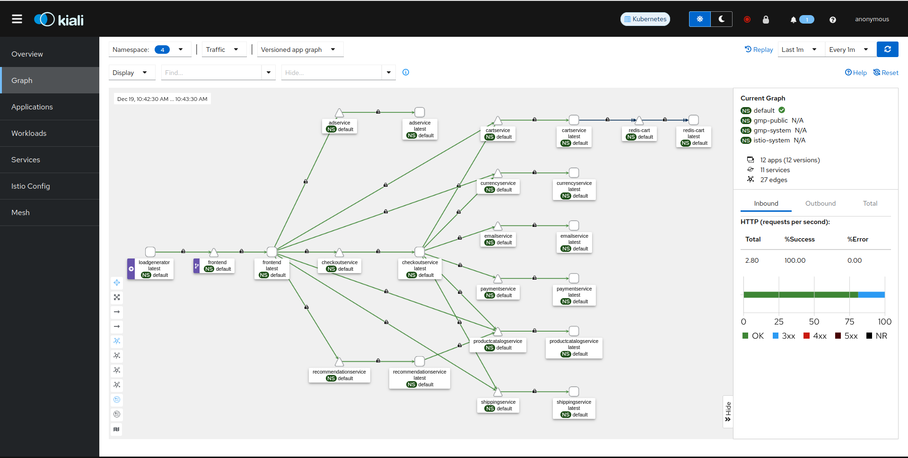

#### Grafana Dashboard


## Secure Gateways & HTTPS

The Control Ingress Traffic task describes how to configure an ingress gateway to expose an HTTP service to external traffic. This task shows how to expose a secure HTTPS service using either simple or mutual TLS. Mutual TLS, or mTLS for short, is a method for `mutual authentication`. mTLS ensures that the parties at each end of a network connection are who they claim to be by verifying that they both have the correct private key. The information within their respective TLS certificates provides additional verification.

### Generating certificates and keys

```sh
#Create a root certificate and private key to sign the certificates for your services:
openssl req -x509 -sha256 -nodes -days 365 \
-newkey rsa:2048 \
-subj '/O=Fortiboutique Inc./CN=onlineboutique.duckdns.org' \
-keyout boutique_certs/boutique.selfsign.key \
-out boutique_certs/boutique.selfsign.crt

#Generate a certificate and a private key for onlineboutique.duckdns.org
#Command 1:
openssl req -out boutique_certs/boutique.com.csr \
-newkey rsa:2048 -nodes \
-keyout boutique_certs/boutique.com.key \
-subj "/CN=onlineboutique.duckdns.org/O=Fortiboutique organization"

#Command 2:                                                                                                                     
openssl x509 -req -sha256 -days 365 \
-CA boutique_certs/boutique.selfsign.crt \
-CAkey boutique_certs/boutique.selfsign.key \
-set_serial 0 \
-in boutique_certs/boutique.com.csr \
-out boutique_certs/boutique.com.crt
```

Finally, once the certificates exist, these can be created as a usable secret in the cluster:                                                                                                                              

```sh                       
kubectl create secret tls boutique-credential \
--key=boutique_certs/boutique.com.key \
--cert=boutique_certs/boutique.com.crt
```

The secret will be created for the default namespace, and contains the certificate and key:

```
Name:         boutique-credential
Namespace:    default
Labels:       <none>
Annotations:  <none>

Type:  kubernetes.io/tls

Data
====
tls.crt:  1103 bytes
tls.key:  1700 bytes

```

The Gateway for the frontend, as well as the HTTPRoute can reference the name of the secret when referencing the certificate. In this case, the secret has the identifier `boutique-credential`, which is referenced under `certificateRefs`.

Simultaneously, Port 80, and HTTP traffic can be disabled. 

```yaml
apiVersion: gateway.networking.k8s.io/v1beta1
kind: Gateway
metadata:
  name: istio-gateway
spec:
  gatewayClassName: istio
  listeners:
  # - name: http                 <-- Disabled to disallow traffic over port 80
  #   port: 80
  #   protocol: HTTP
  #   allowedRoutes:
  #     namespaces:
  #       from: Same
  - name: https
    hostname: "onlineboutique.duckdns.org"
    port: 443
    protocol: HTTPS
    tls:
      mode: Terminate
      certificateRefs:
      - name: boutique-credential
    allowedRoutes:
      namespaces:
        from: Selector
        selector:
          matchLabels:
            kubernetes.io/metadata.name: default
---
apiVersion: gateway.networking.k8s.io/v1beta1
kind: HTTPRoute
metadata:
  name: frontend-route
spec:
  parentRefs:
  - name: istio-gateway
  hostnames: ["onlineboutique.duckdns.org"]
  rules:
  - matches:
    - path:
        value: /
    backendRefs:
    - name: frontend
      port: 80

```
The webpage shows that the HTTPS connection is now working:
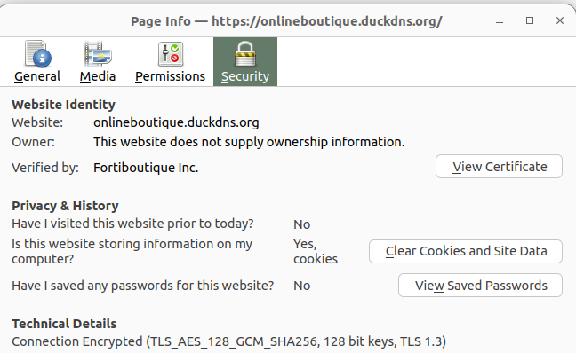

With HTTPS traffic it is now more difficult to identify personal information when monitoring the network traffic. Below is an example of a checkout on the online store, whilst network traffic is being watched with Wireshark:


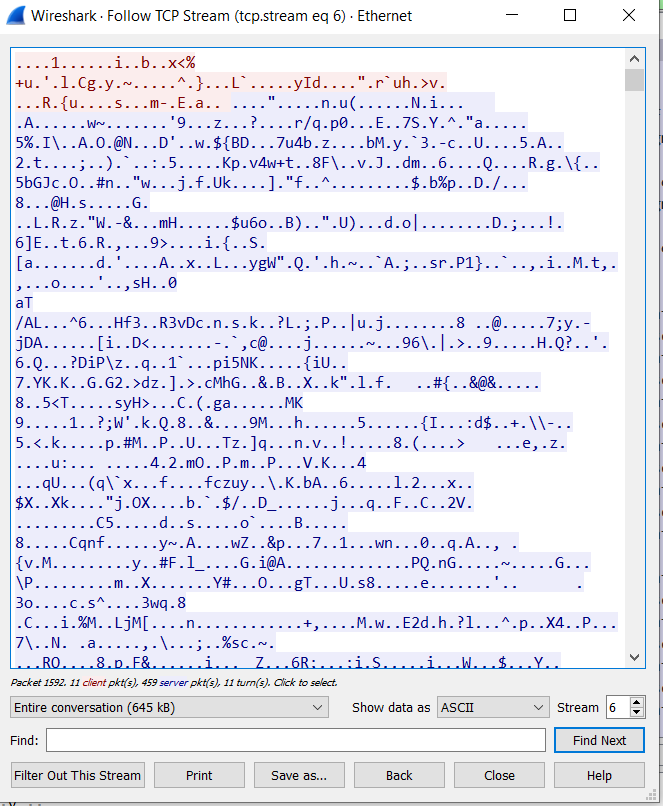

## Snyk: GCR monitoring

Snyk allows a lot of integrations. The three we will focus on are gcr, dockerhub and github.
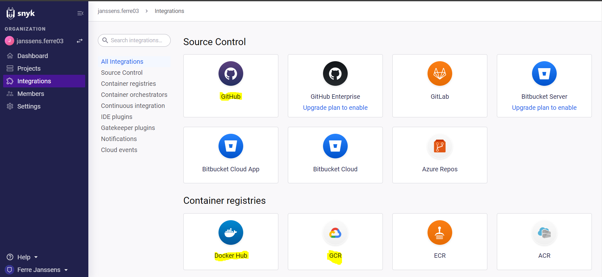

### GCR integration
To enable Snyk on google cloud we need to create service account for Snyk.
Fist we must ensure that Cloud Resource Manager API is enabled on our project.
(add photo)

After enableing the Cloud Resource Manager API we create a service account with the Storage Object Viewer permissions.
(add photo)

When the service account is created we can create an api key for the account to use for the Snyk integration.
(add photo)

We can use the created api key to create the integration. In our example our GCR hostname is gcr.io.
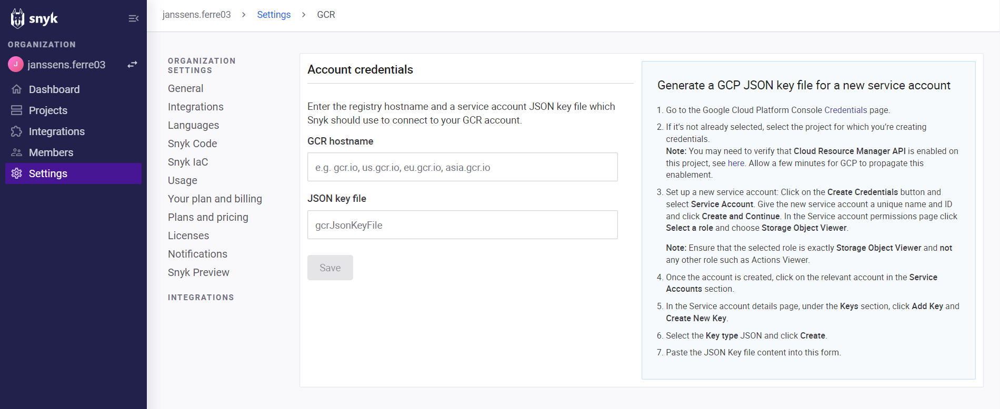

When the integration is succesfull we can add specific images used in our google cloud project and monitor the security flaws for these images.
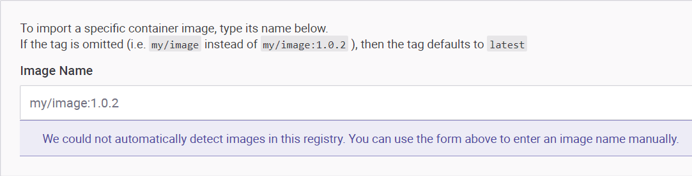

### Dockerhub integration
To integrate dockerhub hosted images we follow the guide provided by Snyk.
First we create an access token for our dockerhub account.
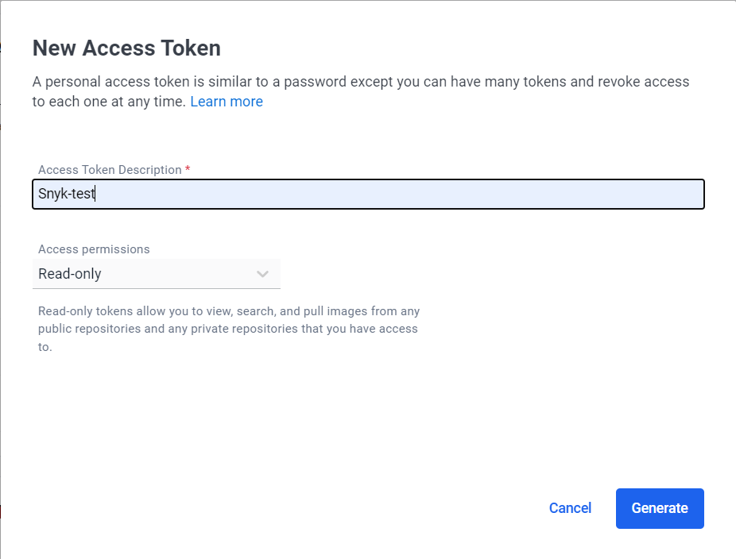
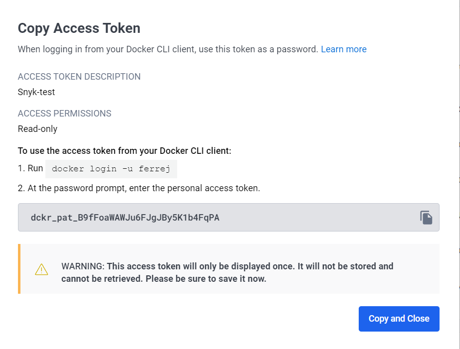

After creating the token we use it in the integration of Snyk for docker.
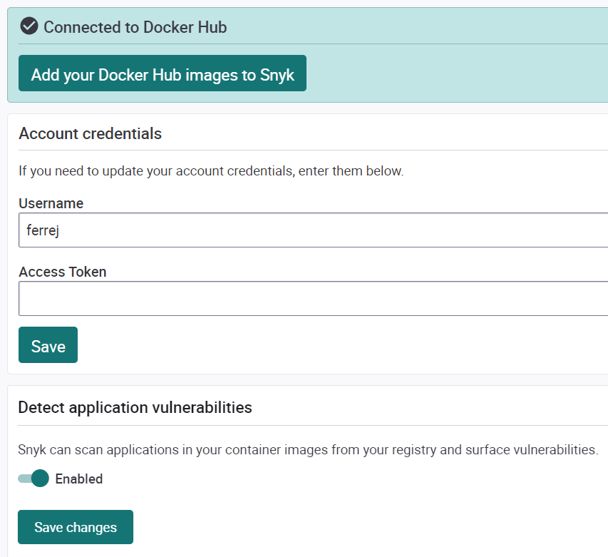

When the integration is succesfull, we can add docker images to scan for vulnerabilities. These can be your own docker images or publicly hosted images.
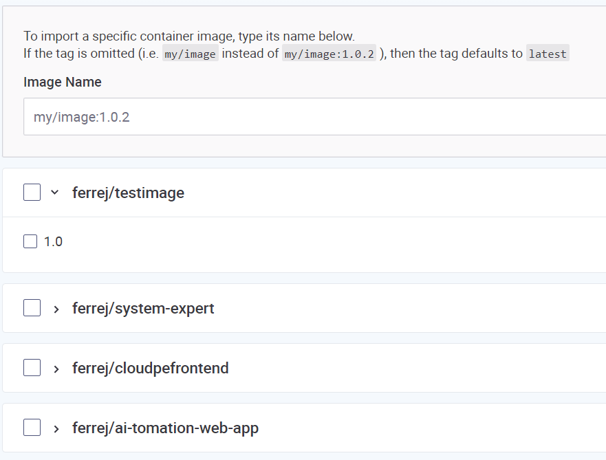

### Github integration
When integration github you will get prompted to login to github and allow Snyk to use specific resources.
After logging in, we can choose wich github repos we want to add to our Snyk project.
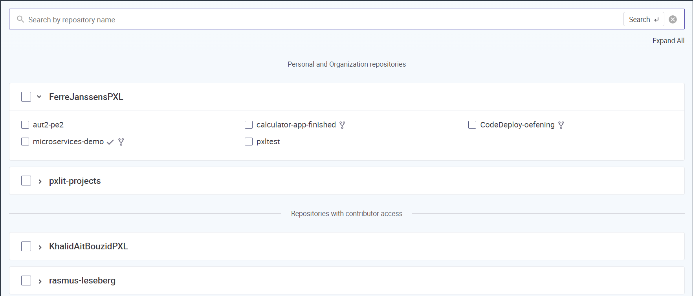

After a succesfull integration we get prompted on the dashboard to create pull requests to fix security issues.
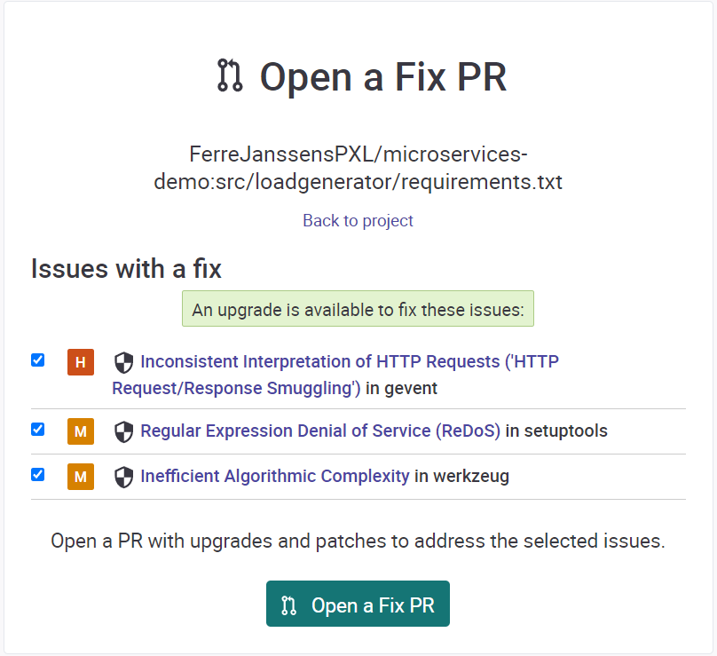
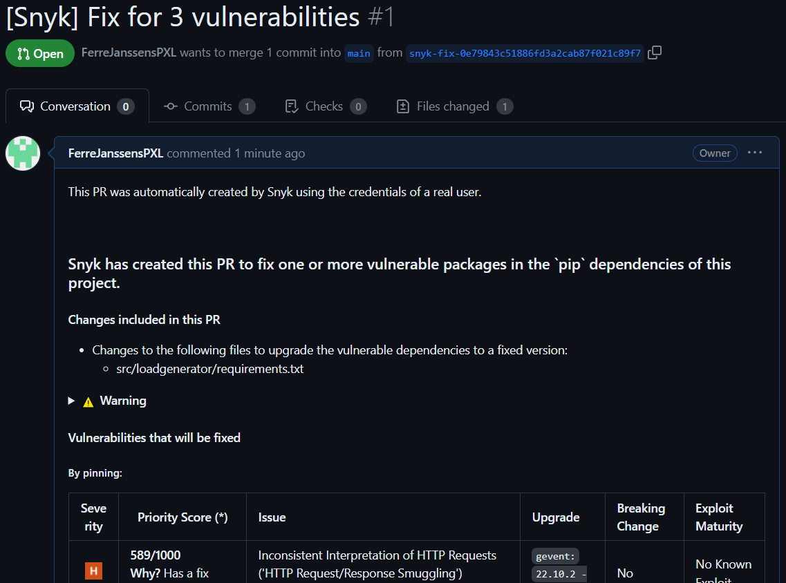
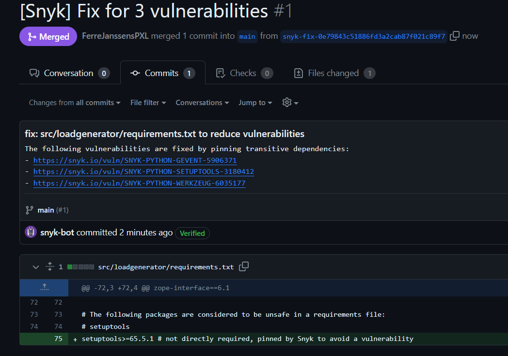


After these integrations a preview of all security issues can be viewed on the projects tab of the Snyk interface.
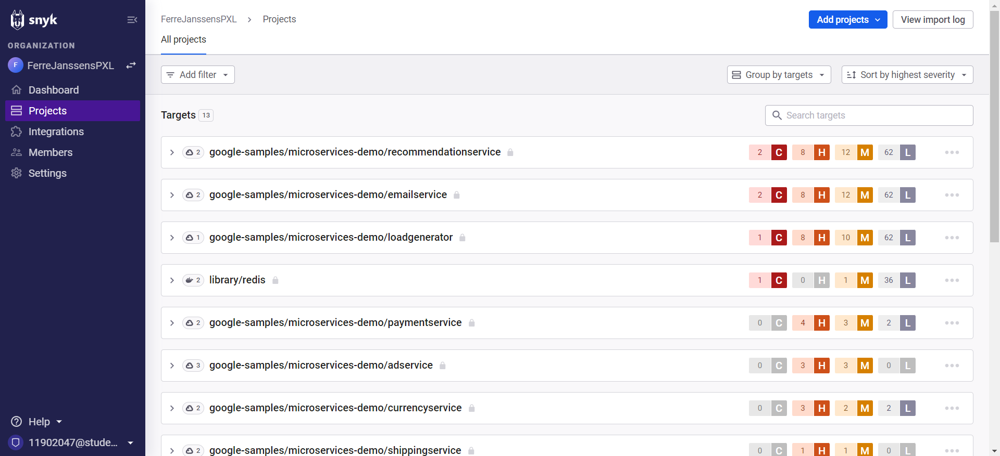


## Implementing the Vault Operator
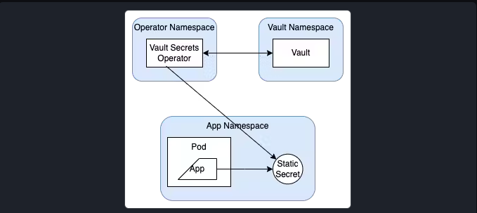

The prerequisites include an existing cluster. 
The [Vault Secrets Operator](https://developer.hashicorp.com/vault/tutorials/kubernetes/vault-secrets-operator) tutorial was followed for this part, and some files from that repository were used:

```sh
git clone https://github.com/hashicorp-education/learn-vault-secrets-operator.git
cd learn-vault-secrets-operator
```

### Configure Vault

We can install Vault in it's own virtual cluster namespace:

```sh
helm repo add hashicorp https://helm.releases.hashicorp.com
helm repo update
helm search repo hashicorp/vault
helm install vault hashicorp/vault -n vault --create-namespace --values vault/vault-values.yaml
```

The last command install vault with a config file that the tutorial provides:

```yaml
server:
  dev:
    enabled: true
    devRootToken: "root"
  logLevel: debug
  # service:
  #   enabled: true
  #   type: ClusterIP
  #   # Port on which Vault server is listening
  #   port: 8200
  #   # Target port to which the service should be mapped to
  #   targetPort: 8200
ui:
  enabled: true
  serviceType: "LoadBalancer"
  externalPort: 8200

injector:
  enabled: "false"
```

This enables the UI for easier secret management. To configure Vault we execute vault configuration commands inside the Vault pod:

```sh
#Enter the pod
kubectl exec --stdin=true --tty=true vault-0 -n vault -- /bin/sh

#Enable kubernetes auth method
vault auth enable -path demo-auth-mount kubernetes

#Configure the auth method
vault write auth/demo-auth-mount/config \
    kubernetes_host="https://$KUBERNETES_PORT_443_TCP_ADDR:443"

#Enable the kv v2 Secrets Engine
vault secrets enable -path=kvv2 kv-v2

#Create a read only policy
vault policy write dev - <<EOF
path "kvv2/*" {
   capabilities = ["read"]
}
EOF

#Create a role in Vault to enable access to secret
vault write auth/demo-auth-mount/role/role1 \
   bound_service_account_names=default \
   bound_service_account_namespaces=default \
   policies=dev \
   audience=vault \
   ttl=24h

#Add the certs to Vault
vault kv put kvv2/frontend_gateway/certs tls.crt="<certificate>" tls.key="<key>"
exit
```

### Install the Vault Secrets Operator

Use helm to deploy the Vault Secrets Operator.

```sh
helm install vault-secrets-operator hashicorp/vault-secrets-operator -n vault-secrets-operator-system --create-namespace --values vault/vault-operator-values.yaml
```

The contents of the `vault-operator-values` are: 

```yaml
defaultVaultConnection:
  enabled: true
  address: "http://vault.vault.svc.cluster.local:8200"
  skipTLSVerify: false
controller:
  manager:
    clientCache:
      persistenceModel: direct-encrypted
      storageEncryption:
        enabled: true
        mount: demo-auth-mount
        keyName: vso-client-cache
        transitMount: demo-transit
        kubernetes:
          role: auth-role-operator
          serviceAccount: demo-operator
```

This establishes the communication with the vault service.

### Deploy and sync a secret

To deploy the secret, use:

```sh
kubectl apply -f vault/vault-auth-static.yaml
```

The contents of the `vault-auth-static` file are:

```yaml
apiVersion: secrets.hashicorp.com/v1beta1
kind: VaultAuth
metadata:
  name: static-auth
  namespace: default 
spec:
  method: kubernetes
  mount: demo-auth-mount
  kubernetes:
    role: role1
    serviceAccount: default
    audiences:
      - vault
```

Be sure to match the namespace where you want to use the secret. Finally, the secret can be referenced in the frontend Gateway:

```yaml
apiVersion: gateway.networking.k8s.io/v1beta1
kind: Gateway
...
- name: https
  hostname: "onlineboutique.duckdns.org"
  port: 443
  protocol: HTTPS
  tls:
    mode: Terminate
    certificateRefs:
    - name: secretkv     #<-- reference the secret
...
```
## Armosec: E2E Kubernetes Security & Compliance

```sh
helm repo add kubescape https://kubescape.github.io/helm-charts/ ; helm repo update ; helm upgrade --install kubescape kubescape/kubescape-operator -n kubescape --create-namespace --set clusterName=`kubectl config current-context` --set account=6f5b87ed-38d2-4bc0-b5d6-fb3fa2c80d23 --set server=api.armosec.io
```

The comand above installs the kubescape operator on the cluster. So that it can be used to scan the cluster for vulnerabilities.

The `account` and `server` values are obtained from the Armosec console. The `clusterName` is the name of the cluster, which can be obtained with `kubectl config current-context`.

Armosec operates as a Kubernetes operator, continuously monitoring and securing your cluster. Here's a brief overview of how Armosec works:

Armosec deploys lightweight agents on each node in your Kubernetes cluster.
These agents collect runtime data and communicate with the Armosec platform. It also assesses the risk level of your Kubernetes resources by analyzing their configurations and runtime behavior.

The Armosec platform analyzes the data collected by the agents and provides you with a comprehensive view of your cluster's security posture.

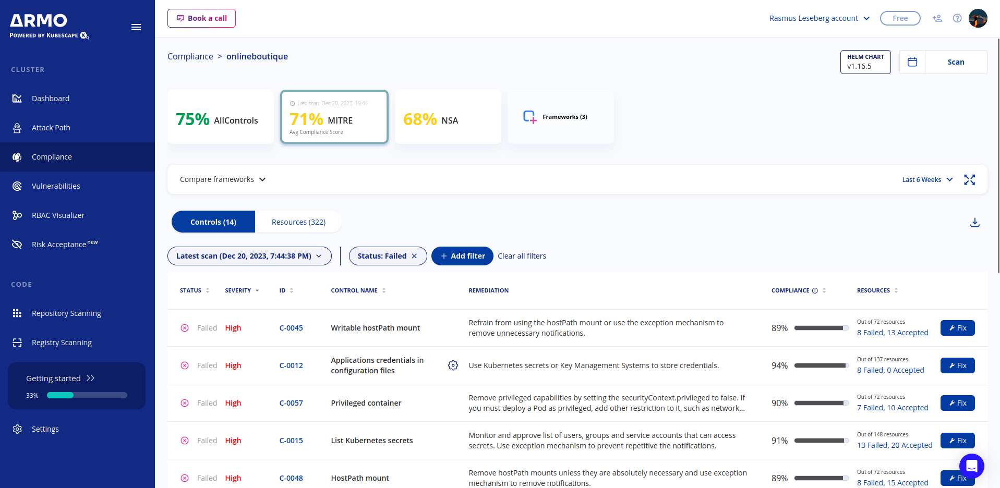
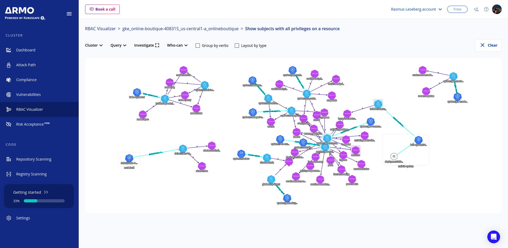

## Redis & Encryption at Rest
GDRP Article 4, which can also be found in Confluence under Chapter 1 Article 4.

For the purposes of this Regulation:

‘personal data’ means any information relating to an identified or identifiable natural person (‘data subject’); an identifiable natural person is one who can be identified, directly or indirectly, in particular by reference to an identifier such as a name, an identification number, location data, an online identifier or to one or more factors specific to the physical, physiological, genetic, mental, economic, cultural or social identity of that natural person;
‘processing’ means any operation or set of operations which is performed on personal data or on sets of personal data, whether or not by automated means, such as collection, recording, organisation, structuring, storage, adaptation or alteration, retrieval, consultation, use, disclosure by transmission, dissemination or otherwise making available, alignment or combination, restriction, erasure or destruction;

‘restriction of processing’ means the marking of stored personal data with the aim of limiting their processing in the future;

‘profiling’ means any form of automated processing of personal data consisting of the use of personal data to evaluate certain personal aspects relating to a natural person, in particular to analyse or predict aspects concerning that natural person’s performance at work, economic situation, health, personal preferences, interests, reliability, behaviour, location or movements;

‘pseudonymisation’ means the processing of personal data in such a manner that the personal data can no longer be attributed to a specific data subject without the use of additional information, provided that such additional information is kept separately and is subject to technical and organisational measures to ensure that the personal data are not attributed to an identified or identifiable natural person;
 

This article specifies that so long as the data cannot be traced back to a specific person, it is not considered personal data. This can be observed in the following images:

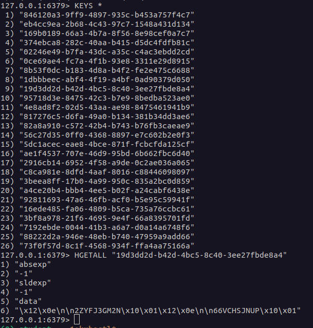
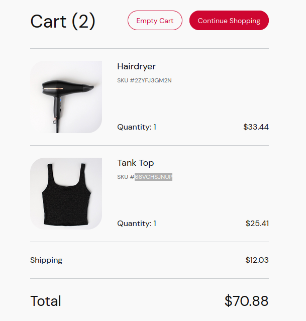

The data is stored in a redis database, which is encrypted at rest. The data is stored in a key-value pair, where the key is the session id, and the value is the cart contents. The session id is a randomly generated string, and the cart contents are a list of items. The data is not directly linked to a person, and therefore is not considered personal data.